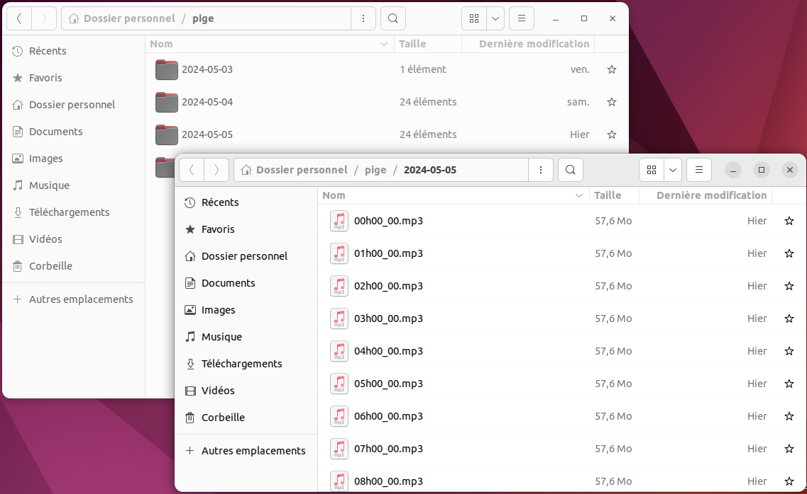
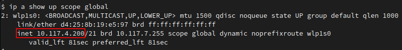
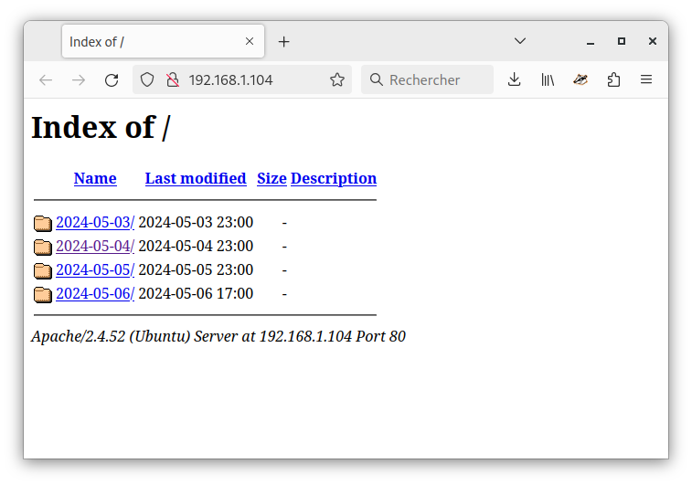
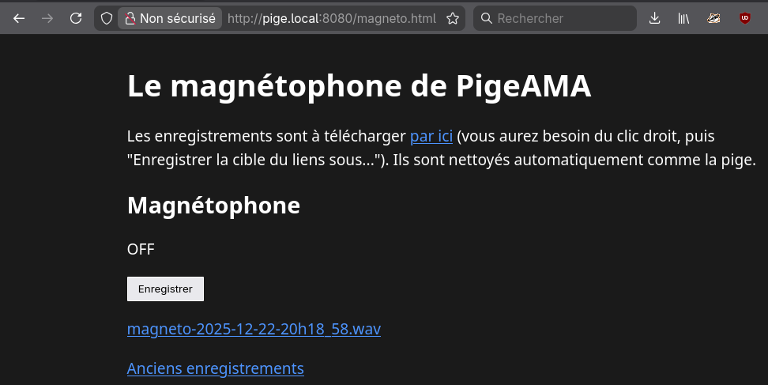

# PigeAMA

## Qu'est-ce que c'est ?

PigeAMA, pour Pige d'Antenne Marchant Automatiquement
(mais surtout pour le jeux de mots),
est un outil d'installation d'une pige d'antenne pensé pour les radios associatives.
Il intègre aussi une petite page "magnétophone" pour avoir des fichiers
pré-découpés à la demande.
En partant d'un ordinateur sous Linux,
il installe et configure des logiciels libres :

* [Liquidsoap](https://liquidsoap.info)
pour enregistrer ce qui arrive dans la carte son,
découpé en fichiers par heure et en dossiers par jour.
* [Samba](https://www.samba.org/)
pour mettre à disposition ces fichiers sur le réseau local,
même depuis Windows.
* [Apache](https://httpd.apache.org/)
pour télécharger ces fichiers
avec un navigateur Web.

PigeAMA ne sert qu'à l'installation : ensuite ça enregistre
et ça continuera de le faire pendant longtemps.
Libre à vous de modifier ce qui est installé,
par exemple pour changer les moyens d'accès aux enregistrements ou
envoyer le flux sonore vers un
[Icecast](https://icecast.org/).

# Installer

## Préparation

Prenez un ordinateur de récup (en France, par exemple chez 
[AFB](https://www.afbshop.fr/),
[Ecodair](https://www.ecodair.com/) ou
[TradeDiscount](https://www.tradediscount.com/))
car il n'y a pas besoin d'une machine puissante ni hyper-fiable.
**Il faut surtout un ordinateur avec une carte son,
que vous pouvez régler pour démarrer dès qu'il a du courant
et qui contienne un ou deux disques durs.**
D'ailleurs LE critère est le volume de disque disponible,
qui sera lié au format de fichiers que vous souhaitez utiliser :

<table>
  <thead>
    <tr>
        <th>Format</th>
        <th>Espace à prévoir pour 31 jours</th>
    </tr>
  </thead>
  <tbody>
    <tr><td>WAV</td><td>500 Go</td></tr>
    <tr><td>FLAC</td><td>250 Go</td></tr>
    <tr><td>MP3 (192kbps)</td><td>75 Go</td></tr>
  </tbody>
</table>

**PigeAMA est conçu pour être installé sur Linux,
sur une distribution Debian ou dérivées :
Ubuntu, Mint, ... tout ce qui utilise `apt`.**
L'ordinateur doit avoir accès à Internet au moment de l'installation 
(mais pas forcément ensuite).

Pensez à régler la machine pour qu'elle démarre dès qu'elle est reliée au secteur.
En général c'est une option qui se trouve dans les menus du BIOS,
accessible quand la machine démarre (en appuyant sur F1/F2/F10/DEL/...).

# L'installation

Il y a quelques commandes à recopier dans un terminal :
appuyez sur Entrée à la fin de la ligne.

Téléchargez l'installeur :

    wget https://git.sr.ht/~martink/pigeama/blob/main/src/pigeama.sh

Autorisez l'éxécution de l'installateur :

    chmod +x pigeama.sh

C'est parti :

    NBJOURS=31 FORMATPIGE=flac ./pigeama.sh

Ci-dessus, nous précisons les deux options possibles :

* `NBJOURS` indique la durée de conservation des fichiers,
  en nombre de jours. Par défaut il vaut 31, pour être conforme à la pige légale Arcom/CSA.
  Vous pouvez mettre plus, selon l'espace disque disponible
  (cf. le tableau ci-dessus).
* `FORMATPIGE` indique le format des fichiers enregistrés.
  Vous pouvez utiliser `flac`, `wav` ou `mp3`.
  Le MP3 est réglé à 192kbps, vous pourrez modifier cela après l'installation.
  L'installeur utilisera le même format pour le magnétophone intégré, mais cela sera
  modifiable aussi.

# Une fois installée

Après installation, l'ordinateur va redémarrer, puis enregistrer en continu.
Vérifiez que l'enregistrement fonctionne bien
juste après l'installation, mais aussi mensuellement.
Vous pouvez aussi apporter quelques modifications à l'installation.

## Accéder aux enregistrements

L'enregistreur écrit dans votre répertoire personnel,
dans un dossier `pige`.
A l'intérieur il y aura un dossier par jour,
puis un fichier par heure.
Seul le fichier en cours d'écriture est ouvert : vous pouvez faire ce que vous voulez des autres.
Les plus anciens seront effacés automatiquement.

Normalement, la pige partage aussi sur le réseau local
à l'adresse [http://pige.local/](http://pige.local/).
Cette adresse doit aussi fonctionner pour le partage de fichiers (avec Samba).
Sinon vous pouvez aussi utiliser l'adresse IP :

## Trouver l'adresse IP de la machine

Si votre pige est reliée à un réseau local (via une box Internet, par exemple)
elle rend accessible les fichiers enregistrés aux autres ordinateurs sur ce réseau.
Vous allez avoir besoin de son adresse IP.
Vous pouvez l'afficher en tapant la commande
`ip a show up scope global`,
ce sont les 4 chiffres après `inet` :

Dans les exemples ci-dessous, nous utiliserons l'adresse 192.168.0.123 :
à vous de remplacer par la votre.

## Accès aux fichiers via un navigateur Web

Vous pouvez écouter ou télécharger les fichiers enregistrés avec un navigateur Web,
en vous rendant sur
[http://pige.local/](http://pige.local/)
ou à l'adresse de la machine,
par exemple `http://192.168.0.123/`

## Accès aux fichiers via le dossier partagé

Vous pouvez télécharger les fichiers enregistrés via un partage réseau,
en donnant l'adresse de la machine qui pige.

* Sous Linux, entrez `smb://pige.local/pige` ou `smb://192.168.0.123/pige`.
* Sous Windows, entrez `\\pige\pige` ou `\\192.168.0.123\pige`.

Choisissez l'accès anonyme.
Cet accès est en lecture seule.
Nous vous recommandons de garder ce dossier en Favori sur tous les ordinateurs de la radio.

## Le magnétophone

A l'adresse [http://pige.local:8080/magneto.html](http://pige.local:8080/magneto.html)
vous trouverez un magnétophone qui permet d'enregisrer sur demande,
dans le même format que le reste de la pige.
L'enregistrement se fait dans la machine qui héberge la pige et les fichiers de piges
habituels continuent à être enregistrés aussi.

Si vous souhaitez utilier ce magnétophone via une autre interface et/ou programmer
votre propre logique de début et fin d'enregistrement, vous devrez
trouver un moyen de faire des requêtes HTTP:

 * `POST http://pige.local:8080/magneto` pour démarrer l'enregistrement. Cela répond avec
   une erreur 400 si l'enregistrement est déjà en cours, ou 200 OK.
 * `DELETE http://pige.local:8080/magneto` pour arrêter l'enregistrement. Le texte de la
   réponse contiendra le nom du fichier qui a été enregistré.
   S'il n'y avait pas d'enregistrement en cours, le magnéto répond par une erreur 400.

## Les fichiers installés

Sur la pige, vous trouverez dans le répertoire personnel quelques fichiers qui
peuvent être intéressants si vous souhaitez la modifier ou en cas de problème.

* `installation.log` est une trace de tout ce qui a été affiché pendant l'installation.
  Il ne sert qu'en cas de problème : une fois l'installation rodée,
  vous pouvez le supprimer.
* `pige.log` trace ce qui se passe dans l'enregistreur.
  Il sont archivés puis effacés automatiquement,
  leur contenu peut servir si la pige ne marche pas bien.
* `nettoyeur_pige.sh` est le script qui efface les
  enregistrements au-delà d'un certain âge.
  Il est exécuté automatiquement chaque jour.
  Si vous souhaitez changer la durée de conservation,
  c'est là que ça se passe : le nombre de jours est juste après le `-mtime`.
* `pige.liq` est le script
  [Liquidsoap](https://liquidsoap.info)
  qui s'occupe de l'enregistrement,
  on en reparle ci-dessous.
* `magneto.html` est dans le répertoire de la pige: c'est l'interface du magnétophone.

Les services systèmes installés par PigeAMA sont définis par des fichiers
placés dans le répertoire utilisateur,
dans `~/.config/systemd/user/`.

## Envoyer le flux sonore vers icecast

L'enregistrement est réalisé par un script Liquidsoap : le fichier `pige.liq`.
Vous pouvez l'ouvrir avec un éditeur de texte.
Ce script contient beaucoup de commentaires :
ce sont les lignes qui commencent par un `#`.
Ces lignes sont ignorées par Liquidsoap et nous permettent d'inclure
des notes, des explications, ou des exemples.

**⚠️ Avant toute modification du fichier `pige.liq`,
faites-en une copie de sauvegarde pour pouvoir revenir à une version fonctionnelle, au cas où.
Vous pouvez aussi utiliser un gestionnaire de versions, comme Git.**

  Ce script est aussi capable d'envoyer le flux sonore vers un serveur de streaming Icecast.
  Il peut à la fois enregistrer des fichiers et envoyer vers Icecast, ou ne faire que l'un des deux,
  ou encore envoyer vers plusieurs Icecast avec des format différents.

  A la fin du fichier, vous trouverez un bloc qui ajoute une sortie vers Icecast.
  Mais ce bloc est caché derrière des `#`.
  Pour activer la sortie Icecast,
  retirez-les et remplissez les paramètres correspondant à votre serveur :
  point de montage,
  addresse, utilisateur, mot de passe.

  C'est aussi dans ce script qu'on choisit le format des fichiers, ou du flux Icecast.
  Il y a déjà quelques exemples en commentaire.
  Pour plus de détails, voyez
  <a href="https://www.liquidsoap.info/doc-dev/encoding_formats.html" target="_blank">
    la page de documentation Liquidsoap sur les formats.
  </a>

**Après toute modification du fichier `pige.liq`**, vous devez :
1. Vérifier que la modification est correcte en tapant
  `liquidsoap --check pige.liq` - 
  s'il n'affiche rien, c'est bon !
2. Si la modification est correcte, redémarrez le processus de pige avec la commande
  `systemctl --user restart pige`

## Tests recherchés: Intégrer Stereotool

Si vous utilisez PigeAMA pour envoyer le signal vers Icecast ou autre chose,
il est possible d'appliquer Stereotool sur le signal en entrée.
Cela n'est pas testé, donc si vous le faites pensez à nous le signaler 
(les contacts sont en bas de page).
Théoriquement, après avoir créé un fichier de preset il suffirait d'ajouter
les lignes suivantes dans le script `pige.liq`,
juste avant la définition des sorties :

    entree = stereotool(
      library_file="/path/to/stereotool/shared/lib",
      license_key="my_license_key",
      preset="/path/to/preset/file",
      entree
    )

# A l'aide !

> Dans le doute : reboote.

## En cas de problème à l'installation

Le détail de ce qui s'est passé lors de l'installation est écrit dans le fichier `installation.log`:
son contenu peut contenir des indices.
Attachez ce fichier quand vous demandez de l'aide.
Relancez l'installation en ajoutant `DEBUG=1` pour avoir encore plus de détails.
Ce qui donne par exemple

    DEBUG=1 NBJOURS=31 FORMATPIGE=wav ./pigeama.sh

## Peut-on modifier/refaire l'installation ?

Oui. Il est possible de relancer le script d'installation sur une machine
déjà installée, même avec des réglages différents de format de fichier ou
de temps de conservation.

## Mettre à jour

Vous pouvez effectuer les mises à jour habituelles,
avec `apt update` et `apt upgrade`.
Vérifiez que ça pige encore correctement après le redémarrage.
Si ce n'est pas le cas, reprenez l'installation depuis le début.

Si vous avez fait des modifications à la main, pensez à garder séparément une copie
des fichiers concernés, pour pouvoir rétablir vos modifications après la re-installation.

## Si les fichiers ne contiennent que du silence

_Lisez les précautions concernants l'édition du script Liquidsoap dans
la partie sur Icecast_.
Dans le script de base, l'entrée sonore est définie par cette ligne :

    entree = input.alsa()

Si les fichiers ne contiennent que du silence (alors que tout est bien branché,
bien entendu) c'est peut-être que l'ordinateur contient plusieurs cartes son
et que l'on est pas tombé sur la bonne.
Dans ce cas, vous pouvez essayer deux variantes de la ligne de l'entrée sonore :

* Remplacez par `entree = input.pulseaudio()`.
  Vous pouvez alors choisir l'entrée dans la partie "Son" des paramètres système.
* Ou alors précisez l'entrée ALSA, en écrivant `entree = input.alsa(device='hw:1,0')`.
  Le premier chiffre est le numéro de carte son,
  le deuxième est le numéro de périphérique dans la carte.
  Les compteurs commencent à 0, donc l'exemple pointe la première entrée de la deuxième carte son.
  Pour lister les possibilités, utilisez la commande `arecord -l`.

## La mailing-list

Vous pouvez aussi aller voir si la question n'a pas déjà été posée sur
[la mailing-list](https://lists.sr.ht/~martink/pigeama),
ou poser votre question.

# Aidez PigeAMA

PigeAMA est hébergé par [Sourcehut](https://sr.ht/~martink/pigeama/).
Vous pouvez suggérer des modifications ou poser des questions à la mailing-list
de PigeAMA: [~martink/pigeama@lists.sr.ht](mailto:~martink/pigeama@lists.sr.ht)
* Si vous souhaitez recevoir cette mailing-list,
  pour donner un coup de main ou recevoir des nouvelles du projet,
  envoyez un e-mail (même vide) à 
  [~martink/pigeama+subscribe@lists.sr.ht](mailto:~martink/pigeama+subscribe@lists.sr.ht)
* Si vous souhaitez vous désinscrire plus tard, envoyez un e-mail à
[~martink/pigeama+unsubscribe@lists.sr.ht](mailto:~martink/pigeama+unsubscribe@lists.sr.ht)
